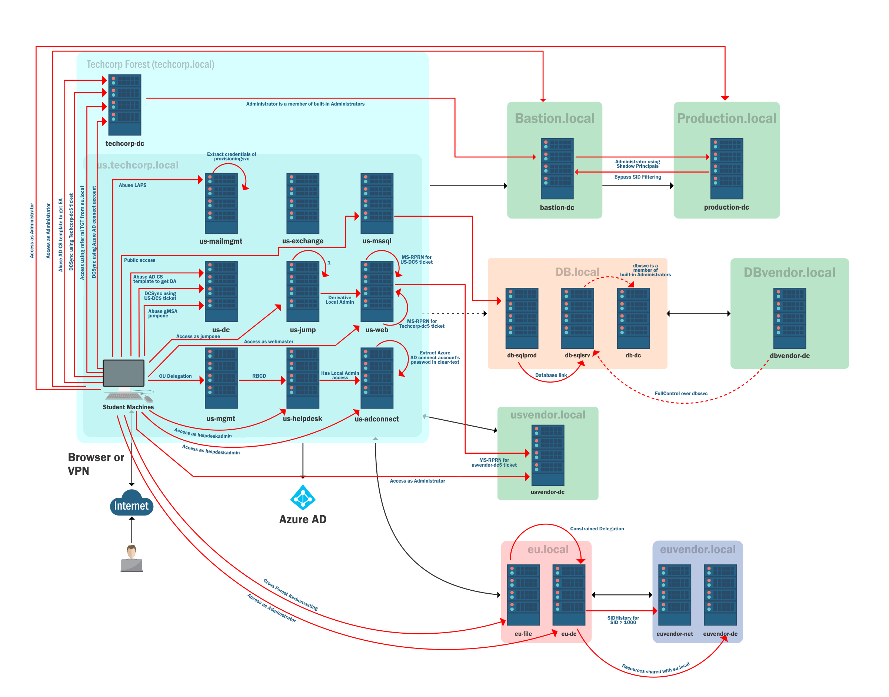

Đây là post đầu tiên của mình trên blog này và cũng là post đầu tiên trong series record lại journey to CRTE. [CRTE - Certified Red Team Expert](https://www.alteredsecurity.com/redteamlab) cũng là cert cần làm lab đầu tiên mà mình sẽ thi. Do là đã xuống tiền mua lab và phí thi rồi (mua từ đợt black friday từ hồi cuối tháng 11 năm ngoài sale 25% còn hơn 6 củ thì phải) nên là phải học thôi. Sếp mình cũng vừa thi đợt gần nghỉ tết và review lại là khó lắm em ạ làm theo dump thì được chứ không có dump cũng khó phết đấy nên là càng phải học cẩn thận thôi. Mục tiêu chính của mình khi chọn để thi cert này thì không hẳn là vì lấy cert chỉ là muốn học thêm kiến thức về AD security và phục vụ công việc nữa nên sẽ quyết tâm không dùng dump. Dự kiến cuối tháng 4 mình sẽ thi.
**Bắt đầu thôi !!!**
Bản thân mình thì cũng đã có ksiến thức cơ bản về AD từ trước, cũng có hoàn thành course [Active Directory Enumeration & Attacks](https://academy.hackthebox.com/module/complete/143) trên **Hack The Box** và cũng có một ít kinh nghiệm về pentest AD trong quá trình làm việc. Thông qua việc thi cert này thì mình cũng muốn hệ thống hóa lại kiến thức và hiểu đươc bản chất các protocol của kiến trúc AD cũng như các kĩ thuật, công cụ tấn công AD và các defense lại.  
Trong post đầu tiên này mình sẽ tổng hợp lại một các tóm tắt về mặt lý thuyết thì để thi được CRTE thì yêu cầu những kiến thức gì về AD và mô tả lại topology các máy sẽ khai thác trong bài lab. Các kiến thức cả về lý thuyết cũng nhu thực hành này sẽ dựa trên tài liệu đi kèm của **Altered Security** khi mình mua lab và cũng có thể dựa trên nhiều nguồn tài liệu khác nữa. 
# Theory and Techniques about AD Attack & Defense
________________
## 1. Architecture of AD
Phần này thì mình sẽ note lại những kiến thức về các thành phần cơ bản của hệ thống AD ví dụ như:
-  Các khái niệm về Domain, Forest, OU, GPO, SPNSPN
-  Access List
-  LAPS 
-  Các giao thức như: Kerbeos, LDAP, ... 
## 2. Enumeration of AD
- Sử dụng thành thạo các công cụ enumeration như: Powerview, ADModule, Sharphound, ...
- Các kỹ thuật enumeration các thông tin bao gồm như: GPO, ACL, Trust, ...
- Các kỹ thuật Bypass AV
## 3. Attack techofniques  AD
- Các kỹ thuật để Local Privilege
- Các kỹ thuật tấn công Kerberos: Golden ticket, Delegation,...
- Các kỹ thuật Lateral Movement: Pas the ticket, DCSync, ...
## 4. Detection & Defense: 
Phần này mình chưa có kiến thức gì nên mình sẽ học đã rồi bổ sung vào các post sau
# Topology of the exam
_____________________________
## 1. Topology của Lab Practice
- Topo các forest, domain và machine: 

- Topo các hướng tấn công trong Lab Practice

## 2. Topology của Lab Exam
Chưa thi nên chưa biết. Phần này mình sẽ tham khảo các report khác để hoàn thành sau.